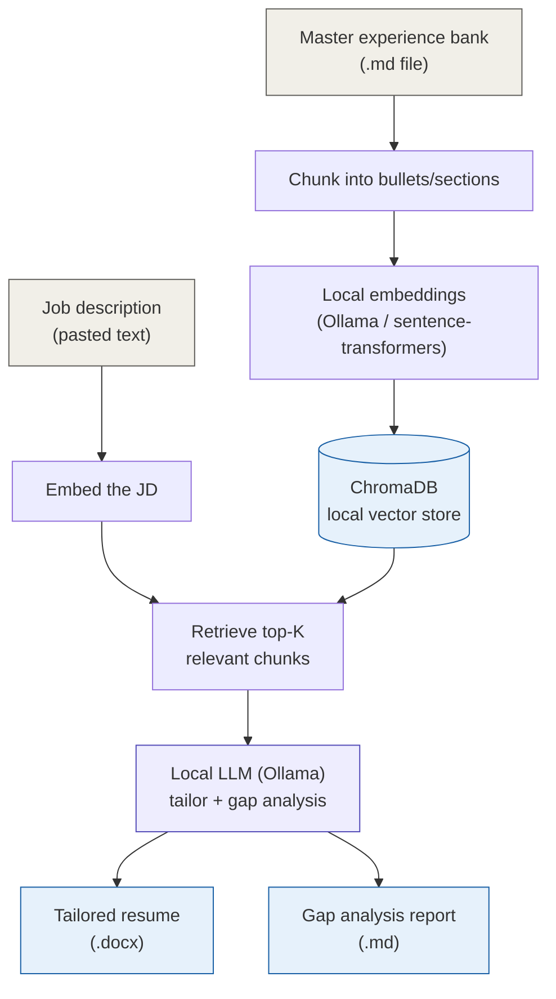
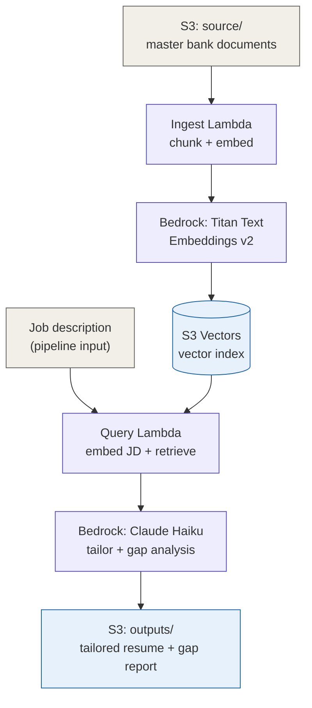

# Resume-to-Job-Description Tailoring Pipeline (RAG)

A Retrieval-Augmented Generation pipeline that takes a **master bank** of your full career experience (every bullet, every project, everything you've ever done) and a **target job description**, retrieves the most relevant pieces of your actual experience, and produces a tailored resume plus a gap analysis — built in two independent versions: one fully local (no cloud, no internet dependency after setup), one on AWS.

## Status

🚧 In progress — build starting. See [Build Log](#build-log).

## The core idea

Most "AI resume tailoring" tools either hallucinate experience you don't have, or just keyword-stuff your existing resume. This pipeline does neither:

1. You maintain one **master experience bank** — every bullet point, every project, every accomplishment you've ever had, all in one place, larger and more granular than any single resume would ever be.
2. For a specific job description, the pipeline **retrieves only the pieces of your real experience that are actually relevant** to that JD (via semantic search over embeddings — not keyword matching).
3. An LLM **rewrites and reframes** those retrieved, real pieces of experience to match the JD's language — but never invents anything that isn't already in your bank.
4. A separate **gap analysis** honestly identifies what the JD asks for that your bank has no good match for — useful for interview prep or knowing what to build/learn next.

## Two versions, same core logic

| | Local version | AWS version |
|---|---|---|
| LLM | Fully offline via Ollama | Claude (Haiku) via Amazon Bedrock |
| Embeddings | Local (Ollama / sentence-transformers) | Amazon Titan Text Embeddings v2 (Bedrock) |
| Vector store | ChromaDB (local, file-based) | Amazon S3 Vectors |
| Runs | Entirely on your machine, no internet needed after model download | Entirely on AWS, triggered on demand |
| Cost | $0 (your own compute) | Cents per month at this usage level (see [Cost](#cost)) |

Built in that order deliberately: **prove the RAG logic locally first** (fast iteration, zero cost, no cloud debugging), then **port the proven logic to AWS** once it's known to work.

## Architecture — Local version



## Architecture — AWS version



## Why this is a genuine RAG project, not a wrapper around one API call

- **Retrieval actually matters here.** A master bank might have 40-80+ granular chunks; a single JD only needs the 5-10 most relevant. Naively stuffing everything into one prompt would work today but stops scaling the moment the bank grows — real retrieval is what keeps this correct at scale.
- **Grounding prevents hallucination.** The LLM is instructed to rewrite *only* retrieved, real content — never invent an accomplishment. This is the actual point of RAG: constrain generation to real, retrieved facts.
- **The gap report is retrieval's negative space.** Knowing what *wasn't* retrieved with good relevance is just as useful as what was — it's an honest signal of what's actually missing from your experience, not just an LLM being encouraging.

## Tech Stack

**Local version:** Python 3.11+, Ollama (LLM + embeddings), ChromaDB, python-docx

**AWS version:** Terraform, AWS Lambda (Python 3.12), Amazon S3, Amazon S3 Vectors, Amazon Bedrock (Titan Embeddings v2, Claude Haiku)

## Prerequisites

**Local version:**
- Python 3.11+
- [Ollama](https://ollama.com) installed
- A reasonably capable machine — a small local LLM (e.g. an 8B-parameter instruction-tuned model) runs meaningfully faster with a discrete GPU or Apple Silicon; it will run on CPU-only but slower. Check [Ollama's model library](https://ollama.com/library) for current recommended models and their RAM requirements before picking one.

**AWS version:**
- AWS account with permissions for S3, S3 Vectors, Lambda, IAM, and Bedrock
- Bedrock Anthropic model use-case details already submitted (one-time per account — see the original [IAM-Compliance-Auditer](https://github.com/imkp004/IAM-Complience-Auditer) README if this hasn't been done yet)
- Terraform >= 1.5, AWS CLI configured

## Project Structure

```
resume-tailor-rag/
├── local/
│   ├── master_bank.md          # your full experience, one bullet/section at a time
│   ├── ingest.py                # chunk + embed + store in ChromaDB
│   ├── retrieve.py              # embed a JD, get top-K relevant chunks
│   ├── generate.py              # local LLM: tailor resume + gap analysis
│   └── main.py                  # CLI entry point: paste a JD, get both outputs
├── aws/
│   ├── terraform/
│   │   ├── main.tf
│   │   ├── variables.tf
│   │   ├── iam.tf
│   │   └── lambda.tf
│   └── lambda/
│       ├── ingest/handler.py
│       └── query/handler.py
├── README.md
└── .gitignore
```

## Cost

**Local version: $0** — your own machine, your own electricity, no API calls, no cloud services.

**AWS version**, at realistic personal usage (a master bank re-embedded occasionally, maybe 20-30 job applications tailored per month):

| Component | Usage | Monthly cost |
|---|---|---|
| Titan Embeddings v2 | Master bank + JD embeddings | Effectively $0 (embedding is priced at roughly $0.02 per million tokens — a full re-embed of an entire resume bank costs fractions of a cent) |
| S3 Vectors | ~50-100 small vectors, occasional queries | Well under $1/month — no idle/minimum cost, pure pay-per-use |
| Claude Haiku (Bedrock) | ~30 tailoring + gap-analysis calls/month | Roughly $0.20-$0.40/month |
| Lambda, S3 (regular) | A handful of invocations/month | $0 (permanent free tier) |
| **Total** | | **Roughly $0.25-$0.50/month** |

This is dramatically cheaper than the "default" Bedrock Knowledge Bases + OpenSearch Serverless path specifically because of the S3 Vectors choice — see [Notable design decisions](#notable-design-decisions).

## Notable design decisions

- **S3 Vectors over OpenSearch Serverless.** OpenSearch Serverless has a hard minimum of ~$345-700/month regardless of usage, since it bills provisioned compute capacity rather than consumption. S3 Vectors (GA'd December 2025) stores vectors natively in S3 with no cluster and no minimum — the right choice for a project at this scale, and increasingly the AWS-recommended default even for larger ones.
- **Local version built first, deliberately.** RAG logic (chunking strategy, retrieval quality, prompt design) is far faster and cheaper to iterate on locally than by redeploying Lambda code on every change. The AWS version ports already-validated logic rather than debugging RAG design and cloud infrastructure simultaneously.
- **Retrieval and generation stay separate.** Same principle as the original IAM auditor project — retrieval either finds relevant chunks or it doesn't (testable, deterministic-ish), while generation is where the LLM does creative rewriting. Keeping them as separate functions makes each independently testable.

## Build Log

### Phase 1 — Local version
- [ ] Step 1 — Project setup: Python environment, Ollama install, pull models
- [ ] Step 2 — Master experience bank: format spec, write your own bank file
- [ ] Step 3 — Chunking + local embeddings + ChromaDB ingestion
- [ ] Step 4 — Retrieval: embed a JD, query top-K relevant chunks
- [ ] Step 5 — Generation: local LLM drafts tailored resume + gap analysis
- [ ] Step 6 — Output: render tailored resume as .docx, gap report as markdown
- [ ] Step 7 — CLI wrapper: one command, paste a JD, get both outputs
- [ ] Step 8 — End-to-end test with a real job description

### Phase 2 — AWS version
- [ ] Step 9 — Terraform foundation: S3 buckets, S3 Vectors index, IAM roles
- [ ] Step 10 — Ingest Lambda: chunk + Titan embeddings + write to S3 Vectors
- [ ] Step 11 — Query Lambda: embed JD + retrieve top-K from S3 Vectors
- [ ] Step 12 — Generation: Claude via Bedrock, same prompt logic as local version
- [ ] Step 13 — Output delivery: tailored resume + gap report to S3
- [ ] Step 14 — End-to-end test + cost verification
- [ ] Step 15 — Cleanup & documentation
